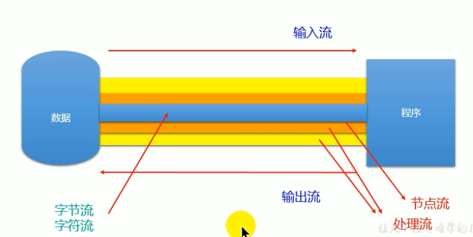
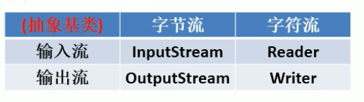
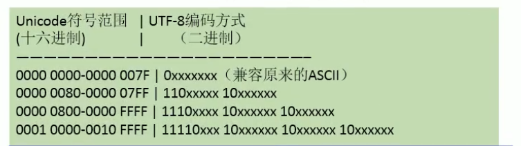
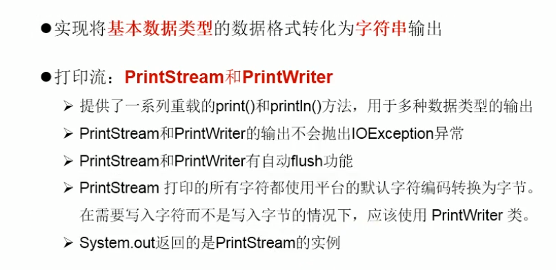
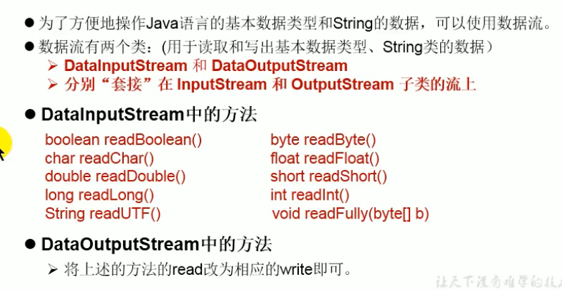

# IO流

## 流的分类

按照操作数据单位不同分为：字节流（8Bit），字符流（16Bit）

按照流向不同分为：输入流，输出流

按照流的角色不同：节点流，处理流





## 字符流的基本用法

### 读入数据

```java
public class FileReaderWriterTest {
    //将hello.txt文件内容读入程序中，并输出到控制台
    public static void main(String[] args) throws IOException {
        //1.实例化File类对象，指明要操作的文件
        File file = new File("javaLearning/hello.txt");
        //2.提供具体的流
        FileReader fr = new FileReader(file);
        //3.数据的读入
        //read():返回读入的一个字符。如果达到文件的末尾，返回-1
        int data;
        while ((data=fr.read())!=-1){
            System.out.print((char)data);
        }
        //4.流的关闭操作
        fr.close();
    }
}
```

方式二：try catch finally（为了保证流资源能顺利关闭）

```java
public class FileReaderWriterTest {
    //将hello.txt文件内容读入程序中，并输出到控制台
    public static void main(String[] args) throws IOException {
        FileReader fr = null;
        try {
        	//1.实例化File类对象，指明要操作的文件
        	File file = new File("javaLearning/hello.txt");
            //2.提供具体的流
            fr = new FileReader(file);
            //3.数据的读入
            int data;
            while ((data=fr.read())!=-1){
                System.out.print((char)data);
            }
        } catch (IOException e) {
            e.printStackTrace();
        } finally {
            try {
                if(fr!=null){
                    //4.流的关闭操作
                    fr.close();
                }
            }catch (Exception e){
                e.printStackTrace();
            }
        }
    }
}
```

注意点：

- read():返回读入的一个字符。如果达到文件的末尾，返回-1
- 异常处理：为了保证流资源一定可以执行关闭操作。需要使用try-catch-finally处理
- 读入文件一定要存在，否则会报FileNotFoundException

```java
public class FileReaderWriterTest2 {
    //对read()操作升级，使用read的重载方法
    public static void main(String[] args) throws IOException {
        FileReader fileReader = null;
        try {
            File file = new File("javaLearning/hello.txt");
            fileReader = new FileReader(file);
            char[] cbuf = new char[5];
            int len;
            while ((len = fileReader.read(cbuf))!=-1){
                for (int i = 0; i <len ; i++) {
                    System.out.print(cbuf[i]);
                }
                //用String的构造器
//                String str = new String(cbuf,0,len);
//                System.out.print(str);
            }
        } catch (IOException e) {
            e.printStackTrace();
        } finally {
            fileReader.close();
        }
    }
}
```

### 从内存中写出数据到硬盘中

说明：

1. 输出操作，对应的File可以不存在

2. File对应的文件

   - 如果不存在，在输出的过程中，会自动创建文件

   - 如果存在，

     如果流使用的构造器是：FileWriter(file,false)/FileWriter(file)：对原有文件的覆盖

     如果流使用的构造求是：FileWriter(file,true)：不会对原有文件覆盖，而是在原有文件基础上追加内容

```java
public class FileWriterTest {
    public static void main(String[] args) throws IOException {
        //提供File类的对象，指明写出到的文件
        File file = new File("javaLearning/dream.txt");

        //提供FileWriter的对象，用于数据写出
        FileWriter fileWriter = new FileWriter(file);

        //写出的操作
        fileWriter.write("I have a dream!");

        //流资源的关闭
        fileWriter.close();
    }
}
```

### 文件的复制操作

```java
public class FileCopy {

    public static void main(String[] args) throws IOException {
        //创建File对象，指明写入和写出的文件
        File srcFile = new File("javaLearning/hello.txt");
        File destFile = new File("javaLearning/hello_copy.txt");


        //创建输入流和输出流的对象
        FileReader fileReader = new FileReader(srcFile);
        FileWriter fileWriter = new FileWriter(destFile);

        //数据的读入和写出操作
        char[] cbuf = new char[5];
        int len;
        while ((len=fileReader.read(cbuf))!=-1){
            fileWriter.write(cbuf,0,len);
        }

        //关闭流资源
        fileReader.close();
        fileWriter.close();

    }
}
```

try-catch写法

```java
public class FileCopy {

    public static void main(String[] args) throws IOException {
        FileReader fileReader = null;
        FileWriter fileWriter = null;
        try {
            //创建File对象，指明写入和写出的文件
            File srcFile = new File("javaLearning/hello.txt");
            File destFile = new File("javaLearning/hello_copy.txt");
            //创建输入流和输出流的对象
            fileReader = new FileReader(srcFile);
            fileWriter = new FileWriter(destFile);
            //数据的读入和写出操作
            char[] cbuf = new char[5];
            int len;
            while ((len=fileReader.read(cbuf))!=-1){
                fileWriter.write(cbuf,0,len);
            }
        } catch (IOException e) {
            e.printStackTrace();
        } finally {
            try {
                if(fileReader!=null)
                fileReader.close();
            } catch (IOException e) {
                e.printStackTrace();
            }
            try {
                if(fileWriter!=null)
                fileWriter.close();
            } catch (IOException e) {
                e.printStackTrace();
            }
        }
    }
}
```

==不能用字符流来处理图像等二进制数据==

结论：

1. 对于文本文件（.txt,.java,.c,.cpp），使用字符流处理
2. 对于非文本文件（.jpg,.mp3,.avi），使用字节流处理

## 字节流的基本用法

用法基本上和上面的字符流相同

```java
public class ImageCopy {
    public static void main(String[] args) {
        FileInputStream fileInputStream = null;
        FileOutputStream fileOutputStream = null;
        try {
            //定义file
            File srcFile = new File("javaLearning/coal2.jpg");
            File destFile = new File("javaLearning/coal_copy.jpg");
            //创建输入输出流
            fileInputStream = new FileInputStream(srcFile);
            fileOutputStream = new FileOutputStream(destFile);
            //传输流
            byte[] buff = new byte[256];
            int len;
            while ((len = fileInputStream.read(buff))!=-1){
                fileOutputStream.write(buff,0,len);
            }
        } catch (IOException e) {
            e.printStackTrace();
        } finally {
            //关闭流
            try {
                fileInputStream.close();
            } catch (IOException e) {
                e.printStackTrace();
            }
            try {
                fileOutputStream.close();
            } catch (IOException e) {
                e.printStackTrace();
            }
        }
    }
}
```

## 缓冲流的使用

缓冲流:

- BufferInputStream
- BufferOutputStream
- BufferReader
- BufferWriter

作用：提升流的读入，写出速度

原因：内部提供了一个缓冲区

```java
public class BufferSteamTest {
    public static void main(String[] args) {
        BufferedInputStream bufferedInputStream = null;
        BufferedOutputStream bufferedOutputStream = null;
        try {
            File srcFile = new File("javaLearning/coal2.jpg");
            File destFile = new File("javaLearning/coal_copy.jpg");

            FileInputStream fileInputStream = new FileInputStream(srcFile);
            FileOutputStream fileOutputStream = new FileOutputStream(destFile);

            bufferedInputStream = new BufferedInputStream(fileInputStream);
            bufferedOutputStream = new BufferedOutputStream(fileOutputStream);

            byte[] buffer = new byte[10];
            int len;
            while ((len = bufferedInputStream.read(buffer))!=-1){
                bufferedOutputStream.write(buffer,0,len);
            }
        } catch (IOException e) {
            e.printStackTrace();
        } finally {
            //先关闭外层的流，再关内层的流
            try {
                bufferedInputStream.close();
            } catch (IOException e) {
                e.printStackTrace();
            }
            try {
                bufferedOutputStream.close();
            } catch (IOException e) {
                e.printStackTrace();
            }
            //在关闭外层流的同时，内层流也会自动的进行关闭
//        fileInputStream.close();
//        fileOutputStream.close();

        }
    }
}
```

## 转换流

- InputStreamReader：将一个字节的输入流转化为字符的输入流
- OutputStreamWriter：将一个字符的输出流转换为字节的输出流

作用：提供字节流与字符流之间的转换

解码：字节、字节数组-->字符数组、字符串

编码：字符数组、字符串-->字节、字节数组

字符集

- ASCII：美国标准信息交换码

  用一个字节的7位可以表示

- ISO08859-1：拉丁码表。欧洲码表

  用一个字节的8位表示

- GB2312：中国的中文编码表。最多两个字节编码所有字符

- GBK：中国的中文编码表升级，融合了更多的中文文字符号。最多两个字节编码

- Unicode：国际标准码，融合了目前人类使用的所有字符。为每一个字符分配唯一的支付码。所有文字都用两个字节表示

- UTF-8：变长的编码方式，可用1-4个字节来表示一个字符

- 

```java
public class InputSteamReaderTest {
    public static void main(String[] args) {
        InputStreamReader inputStreamReader = null;//使用系统默认字符集
        try {
            FileInputStream fileInputStream = new FileInputStream("javaLearning/hello.txt");
            inputStreamReader = new InputStreamReader(fileInputStream);

            char[] cbuf = new char[20];
            int len;
            while ((len=inputStreamReader.read(cbuf))!=-1){
                String str = new String(cbuf,0,len);
                System.out.print(str);
            }
        } catch (IOException e) {
            e.printStackTrace();
        } finally {
            try {
                inputStreamReader.close();
            } catch (IOException e) {
                e.printStackTrace();
            }
        }
    }
}
```

## 标准的输入流输出流

System.in和System.out分别代表了系统标准的输入和输出设备

默认的输入设备是：键盘

默认的输出设备是：显示器

System.in的类型是InputStream

System.out的类型是PrintStream，其是OutputStream的子类FilterOutPutStream的子类

重定向：通过System类的setIn，setOut方法对默认设备进行改变

```java
//使用System.in实现：System.in ---> 转换流 ---> BufferedReader的readLine
public class StandardStream {
    public static void main(String[] args) {
        BufferedReader bufferedReader = null;
        try {
            InputStreamReader inputStreamReader = new InputStreamReader(System.in);
            bufferedReader = new BufferedReader(inputStreamReader);
            while (true){
                String data = bufferedReader.readLine();
                if(data.equalsIgnoreCase("e")||data.equalsIgnoreCase("exit")){
                    System.out.println("程序结束");
                    break;
                }
                String s = data.toUpperCase();
                System.out.println(s);
            }
        } catch (IOException e) {
            e.printStackTrace();
        } finally {
            try {
                bufferedReader.close();
            } catch (IOException e) {
                e.printStackTrace();
            }
        }
    }
}
```

## 打印流



```java

```

## 数据流



```java
//将数据写入文件
public class DataStream {
    public static void main(String[] args) {
        DataOutputStream dataOutputStream = null;
        try {
            dataOutputStream = new DataOutputStream(new FileOutputStream("javaLearning/dos.txt"));
            dataOutputStream.writeUTF("hello");
            dataOutputStream.flush();
            dataOutputStream.writeInt(23);
            dataOutputStream.flush();
            dataOutputStream.writeBoolean(true);
            dataOutputStream.flush();
        } catch (IOException e) {
            e.printStackTrace();
        } finally {
            try {
                dataOutputStream.close();
            } catch (IOException e) {
                e.printStackTrace();
            }
        }

    }
}
```

注意点：读取不同类型的数据的顺序要与当初写入文件时，保存的数据的顺序一致

```java
//读取数据
public class DataInputStreamTest {
    public static void main(String[] args) {
        DataInputStream dataInputStreamTest = null;
        try {
            dataInputStreamTest = new DataInputStream(new FileInputStream("javaLearning/dos.txt"));
            String name = dataInputStreamTest.readUTF();
            int age = dataInputStreamTest.readInt();
            boolean is = dataInputStreamTest.readBoolean();

            System.out.println(name+age+is);
        } catch (IOException e) {
            e.printStackTrace();
        } finally {
            try {
                dataInputStreamTest.close();
            } catch (IOException e) {
                e.printStackTrace();
            }
        }
    }
}
```

