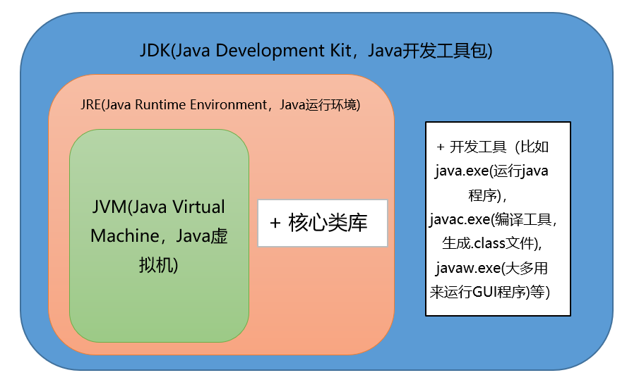

## JVM&JRE&JDK关系



## Java语言有哪些特点

- 面向对象（封装，继承，多态）

- 平台无关性（Java虚拟机实现平台无关性）

- 支持多线程（多线程机制使应用程序在同一时间并行执行多项任）

- 健壮性（Java语言的强类型机制、异常处理、垃圾的自动收集等）

## final关键字的作用

用于修饰类、属性和方法；

- 被final修饰的类不可以被继承
- 被final修饰的方法不可以被重写
- 被final修饰的变量不可以被改变，被final修饰不可变的是变量的引用，而不是引用指向的内容，引用指向的内容是可以改变的

```java
package com.zhongming.trysomething;

public class Main {
    public  final int[] age = new int[]{1,2,3};

    public static void main(String[] args) {
        Main main = new Main();
        for (int n:main.age){
            System.out.print(n+" ");//1 2 3
        }
        System.out.println();
        main.age[0]=2;
        for (int n:main.age){
            System.out.print(n+" ");//2 2 3
        }
    }
}
```

## static存在的主要意义

static的主要意义是在于创建独立于具体对象的域变量或者方法。**以致于即使没有创建对象，也能使用属性和调用方法**！

static关键字还有一个比较关键的作用就是 **用来形成静态代码块以优化程序性能**。static块可以置于类中的任何地方，类中可以有多个static块。在类初次被加载的时候，会按照static块的顺序来执行每个static块，并且只会执行一次。

为什么说static块可以用来优化程序性能，是因为它的特性:只会在类加载的时候执行一次。因此，很多时候会将一些只需要进行一次的初始化操作都放在static代码块中进行。

## 多态的实现

Java实现多态有三个必要条件：继承，重写，向上转型

对于Java而言，它多态的实现机制遵循一个原则：当超类对象引用变量引用子类对象时，被引用对象的类型而不是引用变量的类型决定了调用谁的成员方法，但是这个被调用的方法必须是在超类中定义过的，也就是说被子类覆盖的方法。

##  正确使用 equals 方法

Object的equals方法容易抛空指针异常，应使用常量或确定有值的对象来调用 equals。

```java
// 不能使用一个值为null的引用类型变量来调用非静态方法，否则会抛出异常
String str = null;
if (str.equals("SnailClimb")) {
  ...
} else {
  ..
}
```

应该使用

```java
"SnailClimb".equals(str);// false 
```

更推荐使用`java.util.Objects#equals`(JDK7 引入的工具类)

```java
Objects.equals(null,"SnailClimb");// false
```

`java.util.Objects#equals`源码

```java
public static boolean equals(Object a, Object b) {
    // 可以避免空指针异常。如果a==null的话此时a.equals(b)就不会得到执行，避免出现空指针异常。
    return (a == b) || (a != null && a.equals(b));
}
```

##  整型包装类值的比较

所有整型包装类对象值的比较必须使用equals方法。

```java
Integer x = 3;
Integer y = 3;
System.out.println(x == y);// true
Integer a = new Integer(3);
Integer b = new Integer(3);
System.out.println(a == b);//false
System.out.println(a.equals(b));//true
```

当使用自动装箱方式创建一个Integer对象时，当数值在-128 ~127时，会将创建的 Integer 对象缓存起来，当下次再出现该数值时，直接从缓存中取出对应的Integer对象。所以上述代码中，x和y引用的是相同的Integer对象。

## 编译型语言和解释型语言的区别

一个是编译，一个是解释。两种方式只是翻译的时间不同。编译型语言写的程序执行之前，需要一个专门的编译过程，把程序编译成为机器语言的文件，比如exe文件，以后要运行的话就不用重新翻译了，直接使用编译的结果就行了（exe文件），因为翻译只做了一次，运行时不需要翻译，所以编译型语言的程序执行效率高，但也不能一概而论，部分解释型语言的解释器通过在运行时动态优化代码，甚至能够使解释型语言的性能超过编译型语言。
解释则不同，解释性语言的程序不需要编译，省了道工序，解释性语言在运行程序的时候才翻译，比如解释性basic语言，专门有一个解释器能够直接执行basic程序，每个语句都是执行的时候才翻译。这样解释性语言每执行一次就要翻译一次，效率比较低。解释是一句一句的翻译。