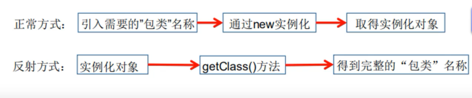
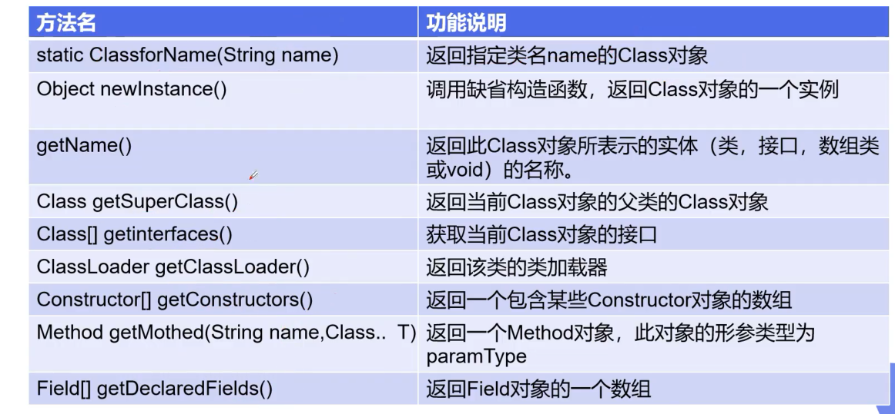
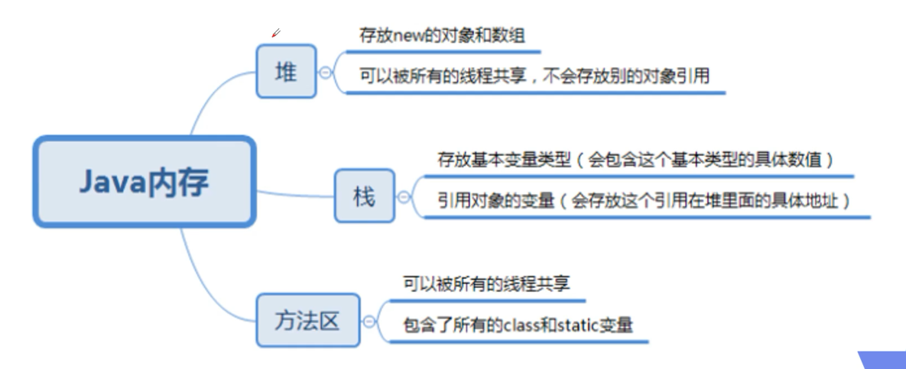

# 注解和反射

## 注解

### Annotation的作用

- 不是程序本身，可以对程序做出解释（这一点和注释没什么区别）
- 可以被其他程序（比如：编译器）读取
- **我们可以通过反射机制编程实现对这些元数据的访问**

### 内置注解

- @OverRide：定义在java.lang.Override中，此注释只使用于修辞方法，表示一个方法声明打算重写超类中的另一个方法声明
- @Deprecated：定义在java.lang.Deprecated中，此注释可以用于修辞方法，属性，类，表示不鼓励程序员使用这样的元素，通常是因为它很危险或者存在更好的选择
- @SuppressWarnings：定义在java.lang.SuppressWarning中，用于一直编译时的警告信息

### 元注解

元注解的作用就是负责注解其他注解（简称套娃）

- @Target：用于描述注解的使用范围
- @Retention：表示需要在什么级别保存该注释信息，用于描述注解的生命周期（Source<Class<Runtime）
- @Doucument：说明该注解将被包含在javadoc中
- @Inherited：说明子类可以继承父类中的该注解

## 反射

Reflection（反射）是Java被视为动态语言的关键，反射机制允许程序在执行期间借助于Reflection API获取任何类的内部信息，并能自己操作任意对象的内部属性及方法

```java
Class c = Class.forName("java.lang.String")
```



### Class类

对象在反射之后可以得到的信息：某个类的属性，方法和构造器、某个类到第实现了哪些接口。

对于每个类而言，JRE都为其保留一个不变的Class类型对象。一个Class对象包含了特定某个结构（class、interface、enum...）的有关信息

- Class本身也是一个类
- Class对象只能由系统简历对象
- 一个加载的类在JVM中只会由一个Class实实例
- 一个Class对象对应的是一个加载到JVM中的一个.class文件
- 每个类的实例都会记得自己是由哪个Class实例所生成
- 通过Class可以完整地得到一个类中的所有被加载的结构
- Class类是Reflection的根源，针对任何你想动态加载、运行的类，唯有先获得相应的Class对象。

### Class类的常用方法



### 获得Class的方法

```java
    public static void main(String[] args) throws ClassNotFoundException {
        Person person = new Student();
        //方式一：通过对象获得
        Class c1 = person.getClass();
        System.out.println(c1.hashCode());

        //方式二：forName获得
        Class c2 = Class.forName("com.zhongming.reflection.Student");
        System.out.println(c2.hashCode());

        //方式三：通过类名.class获得
        Class c3 = Student.class;
        System.out.println(c3.hashCode());

        //方式四：基本类型的包装类都有一个Type属性
        Class c4 = Integer.TYPE;

        //获得父类型
        Class c5 = c1.getSuperclass();
    }
```

### 哪些类型可以有Class对象

- Class：外部类，成员（成员内部类，静态内部类），局部内部类，匿名内部类
- interface：接口
- []：数组
- enum：枚举
- annotation：注解@Interface
- primitive type：基本数据类型
- void

### Java内存分析



### 什么时候会发生类的初始化

类的主动引用（一定会发生类的初始化）

- 当虚拟机启动，先初始化main方法所在的类
- new一个类的对象
- 调用类的静态成员（除了final常量）和静态方法
- 使用java.lang.reflect包的方法对类进行反射调用
- 当初始化一个类，如果其父类没有被初始化，则先会初始化它的父类

类的被动引用（不会发生类的初始化）

- 当访问一个静态域时，只有真正声明这个域的类才会被初始化。如：当通过子类引用父类的静态变量，不会导致子类初始化
- 通过数组定义类的引用，不会出发此类的初始化
- 引用常量不会触发此类的初始化（常量在链接阶段就存入调用类的常量池中了）

### 获得类运行时候的结构

```java
    public static void main(String[] args) throws ClassNotFoundException, NoSuchFieldException, NoSuchMethodException {
        Class c1 = Class.forName("com.zhongming.reflection.User");

        //获得类的名字
        System.out.println(c1.getName());//获得包名+类名
        System.out.println(c1.getSimpleName());//获得类名

        //获得类的属性
        Field[] fields = c1.getFields(); //只能找到public属性
        fields = c1.getDeclaredFields();//找到全部属性
        Field field = c1.getField("name");
        for (Field field1:fields){
            System.out.println(field1);
        }

        //获得类的方法
        Method[] methods = c1.getMethods();//获得本类及其父类的全部public方法
        Method[] methods1 = c1.getDeclaredMethods();//获得本类的所有方法（不包括父类）
        for(Method method:methods1){
            System.out.println(method);
        }
        //获得指定方法
        //重载
        Method getAge = c1.getMethod("getAge");
        Method setAge = c1.getMethod("setAge", String.class);
        
        //获得指定的构造器
        Constructor constructor = c1.getConstructor();
        Constructor[] constructors = c1.getConstructors();
    }
```

### 通过反射动态的创建对象

```java
    public static void main(String[] args) throws ClassNotFoundException, IllegalAccessException, InstantiationException, NoSuchMethodException, InvocationTargetException, NoSuchFieldException {
        //获得class对象
        Class c1 = Class.forName("com.zhongming.reflection.User");

        //构造一个对象
        User o = (User) c1.newInstance();
        System.out.println(o);

        //通过构造器创建对象
        Constructor constructor = c1.getConstructor(String.class,String.class);
        User user2 = (User) constructor.newInstance("tommy", "25");
        System.out.println(user2);

        //通过反射调用普通方法
        User user3 = (User) c1.newInstance();
        //通过反射获得一个方法
        Method setAge = c1.getDeclaredMethod("setAge", String.class);
        //invoke:激活的意思
        //（对象，“方法的值”）
        setAge.invoke(user3,"25");
        System.out.println(user3);

        //通过反射操作属性
        Field name = c1.getDeclaredField("name");
        name.set(user3,"zhongming");
        System.out.println(user3);

        //通过反射操作私有属性
        Field age = c1.getDeclaredField("age");
        age.setAccessible(true);
        age.set(user3,"20");
        System.out.println(user3);

    }
```

### 反射操作注解

利用注解和反射完成类和表结构的映射关系

```java
    public static void main(String[] args) throws ClassNotFoundException, NoSuchFieldException {
        Class c1 = Class.forName("com.zhongming.reflection.Student2");

        //通过反射获得注解
        Annotation[] annotations = c1.getAnnotations();
        for(Annotation annotation:annotations){
            System.out.println(annotation);
        }

        //获得注解的value值
        Table table = (Table) c1.getAnnotation(Table.class);
        String value = table.value();
        System.out.println(value);

        //获得类指定的注解
        Field field = c1.getDeclaredField("name");
        FieldAnnotation annotations1 = field.getAnnotation(FieldAnnotation.class);
        System.out.println(annotations1.columnName());
        System.out.println(annotations1.length());
        System.out.println(annotations1.type());
    }
```

