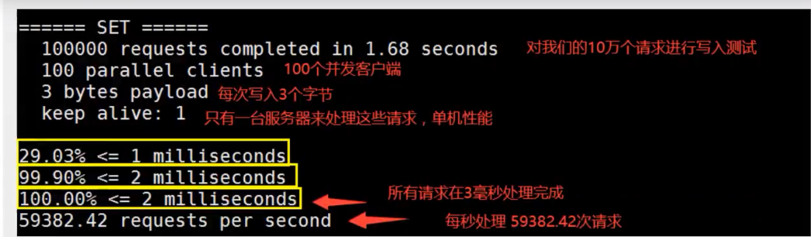

## Redis

### NoSQL概叙

#### 为什么要用NoSQL？

用户的个人信息，社交网络，地理位置以及用户自己所产生的数据，用户日志等等的爆发式增长，普通关系型数据库已经无法满足要求，这时候就需要使用NoSqL数据库，NoSql可以很好的处理以上情况。

#### 什么是NoSQL

NoSQL = Not Only SQL

关系型数据库：

泛指非关系型数据库，随着web2.0互联网的诞生，传统的关系型数据库很难对付web2.0时代，尤其是超大规模的高并发会暴露出很多难以克服的问题，NoSQL在当今大数据环境下发展啊十分迅速，redis是发展最快的，而且是我们当下必须掌握的一个技术。

很多的数据类型用户的个人信息，社交网络，地理位置。这些数据类型的存储不需要一个固定的格式！不需要多余的操作就可以横向发展！Map<String,Object>使用键值对来控制！

#### NoSQL特点

1. 方便扩展（数据之间没有关系，很好扩展！）
2. 大数据量高性能（Redis一秒写8万此，读取11万，NoSQL的缓存记录级，是一种细粒度的缓存，性能会比较高！）
3. 数据类型是多样性的！（不需要事先设计数据库！随取随用）
4. 传动RDMS和NoSQL
   - 传统RDBMS
     - 结构化组织
     - SQL
     - 数据和关系都存在单独的表中
     - 数据定义语言
     - 严格的一致性
     - 基础的事务
   - NoSQL
     - 不仅仅是数据
     - 没有固定的查询语言
     - 键值对存储，列存储，文档存储，图形数据库
     - 最终一致性
     - CAP定理和BASE
     - 高性能，高可用，高可扩展
     - ...

#### TB一个页面所用到数据库底层

1. 商品的基本信息

   名称、价格、商家信息：

   关系型数据库就可以解决了！MySQL/Oracle

2. 商品的描述、评论（文字信息较多的）

   文档型数据库，MongoDB

3. 图片

   分布式文件系统：FastDFS

   - TB自己的：TFS
   - Google：GFS
   - Hadoop：HDFS
   - 阿里云：oss

4. 商品的关键字（搜索）

   - 搜索引擎：solr、elasticSearch

5. 商品热门的波段信息

   内存数据库：Redis、Tair、Memache

6. 商品交易，外部的支付接口

   第三方应用

大型互联网应用问题：

- 数据类型太多了
- 数据源翻多，经常重构
- 数据要改造，大面积改造

#### NoSQL的四大分类

**kv键值对**

- 新浪：Redis
- 美团：Redis+Tair
- 阿里、百度：Redis+memecache

**文档型数据库（Boson格式，和json一样）**

- MongoDB
  - MongoDB是一个基于分布式文件存储数据库，C++，主要用来处理大量的文档
  - MongoDB是一个介于关系型数据库和非关系型数据库中间的产品！MongoDB是非关系型数据库中功能最丰富，最像关系型数据库的
  - ConthDB

**列存储数据库**

- HBase
- 分布式文件系统

**图关系型数据库**

- Neo4j，infoGrid
- 注意该数据库不是存放图形而是存放关系

### Redis入门

#### 概述

**什么是redis**

- Redis（Remote Dictionary Server），远程服务字典
- 是一个开源的使用ANSI C语言编写的，支持网络，可基于内存亦可持久化的日志型，key-Value数据库
- redis会周期性的把更新的数据写入磁盘或者把修改操作写入追加的记录文件，并且在此基础上实现了主从同步，是当下最热门的NoSQL技术之一，也被称之为结构化数据库

**redis能干嘛**

- 内存存储，持久化（rdb、aof）
- 效率高，可以用于高速缓存
- 发布订阅系统
- 地图信息分析
- 计时器、计数器（浏览量）

**特性**

- 多样的数据类型
- 持久化
- 集群
- 事务
- ...

#### Linux安装redis

1. 下载安装包！redis-5.0.8.tar.gz

2. 解压安装包

3. 进入解压文件可以看到redis的配置文件

   

4. 基本环境焊装

   ```shell
   yum install gcc -c++
   make 
   make install
   ```

5. redis的默认安装路径

6. 将redis配置文件，复制到我们当前目录之下

7. redis默认不是后台启动的，修改配置文件

8. 启动redis服务

9. 使用redis-cli进行连接测试

10. 查看redis进程是否开启

11. 如何关闭redis服务

12. 后面会使用单机多redis启动集群

#### 测试性能

- **redis-benchmark**是一个压力测试工具
- 官方自带的性能测试工具
- redis-benchmark命令参数


简单测试一下

```
# 测试：100个并发连接  100000个请求
redis-benchmark -h localhost -p 6379 -c 100 -n 100000
```

如何查看这些分析呢？



#### 基础知识

redis默认有十六个数据库；

可以使用select进行数据库的切换；


```bash
127.0.0.1:6379[3]> keys * #查看数据库所有的key
1) "name"
```

清空当前数据库：**flushdb**

```
127.0.0.1:6379[3]> flushdb
```

清空所有数据库：**FLUSHALL**

```
127.0.0.1:6379[3]> FLUSHALL
```

**redis是单线程的**

因为Redis是基于内存的操作，CPU不是Redis的瓶颈，Redis的瓶颈最有可能是机器内存的大小或者网络带宽。既然单线程容易实现，而且CPU不会成为瓶颈，那就顺理成章地采用单线程的方案了。

**redis为什么那么快**

1. 误区1：高性能的服务器一定是多线程的？
2. 误区2：多线程（cpu上下文会切换）一定比单线程效率高

核心：redis是将所有的数据全部放在内存里面，所以说使用单线程取操作的效率是最高的，而多线程操作cpu会进行上下文切换。此外单线程不需要考虑锁的问题。

### 五大数据类型

Redis 是一个开源（BSD许可）的，内存中的数据结构存储系统，它可以用作数据库、缓存和消息中间件。 它支持多种类型的数据结构，如 字符串（strings）， 散列（hashes）， 列表（lists）， 集合（sets）， 有序集合（sorted sets） 与范围查询， bitmaps， hyperloglogs 和 地理空间（geospatial） 索引半径查询。 Redis 内置了 复制（replication），LUA脚本（Lua scripting）， LRU驱动事件（LRU eviction），事务（transactions） 和不同级别的 磁盘持久化（persistence）， 并通过 Redis哨兵（Sentinel）和自动 分区（Cluster）提供高可用性（high availability）。

**Redis-Key**

```bash
127.0.0.1:6379> keys * #查看所有的key
127.0.0.1:6379> set name zhongming #set key
127.0.0.1:6379> EXISTS name  #判断当前的key是否存在
127.0.0.1:6379> move name 1 * #移除当前的key
127.0.0.1:6379> EXPIRE name 10 #设置key的过期时间，单位是秒
127.0.0.1:6379> ttl name #查看当前key的剩余时间
127.0.0.1:6379> type name #查看当前key的一个类型
```

#### String（字符串）

```bash
set key1 v1 #设置值
get key1    #获得值
keys * #获得所有的key
EXISTS name  #判断当前的key是否存在
APPEND key1 "hello" #追加字符串，如果当前key不存在，就相当于setkey
STRLEN #获取字符串的长度
```

计数器实现

```bash
set view 0 #设置初始浏览量为0
incr view #自增1 浏览量变为1
decr view #自减1
INCRBY view 10 #可以设置步长，指定增量
```

字符串范围

```bash
GETRANGE key1 0 3 #截取字符串[0,3]
GETRANGE key1 0 -1 #截取所有字符串，和get一样的
```

替换

```bash
SETRANG key 1 xx #替换指定位置的字符串
```

setex(set with expire) ：设置过期时间

setnx(set if not exist)：不存在设置（在分布式锁中会常常用到）

```bash
setex keys 30 "hello" #设置key3的值为hello，30s后过期
setnx mykey "redis" #如果mykey不存在，则创建mykey
```

批量设置值

```bash
mset k1 v1 k2 v2 k3 v3 #同时设置多个值
mget k1 k2 k3 #同时获得多个值
msetnx k1 v1 k4 v4 #是一个原子性的操作，要么一起成功，要么一起失败
```

对象

```bash
set user:1 {name:zhangsan,age:3} #设置一个user:1对象，值为json字符串来保存一个对象
#这里key是一个巧妙的设计：user：{id}：{filed}
mset user:1:name zhangsan user:1:age 3
mget user:1:name user:1:age
```

getset

```bash
getset db redis #获取原来的值，并设置新值
```

#### List

在redis里面，可以把List做成栈，队列，阻塞队列

所有List命令都是用l开头的，redis不区分大小写命令

```bash
118.31.50.77:6379> lpush list one #将一个值或者多个值，插入到列表的头部
(integer) 1
118.31.50.77:6379> lpush list two
(integer) 2
118.31.50.77:6379> lpush list three
(integer) 3
118.31.50.77:6379> lrange list 0 -1 #获取list中的值
1) "three"
2) "two"
3) "one"
118.31.50.77:6379> lrange list 0 1
1) "three"
2) "two"
118.31.50.77:6379> rpush list zero #将一个值或者多个值，插入到列表的尾部
(integer) 4
118.31.50.77:6379> lrange list 0 -1
1) "three"
2) "two"
3) "one"
4) "zero"
118.31.50.77:6379>
#################################################################
118.31.50.77:6379> lrange list 0 -1
1) "three"
2) "two"
3) "one"
4) "zero"
118.31.50.77:6379> lpop list #移除列表的第一个元素
"three"
118.31.50.77:6379> lrange list 0 -1
1) "two"
2) "one"
3) "zero"
118.31.50.77:6379> rpop list #移除列表的最后一个元素
"zero"
118.31.50.77:6379> lrange list 0 -1
1) "two"
2) "one"
118.31.50.77:6379>
#################################################################
118.31.50.77:6379> lrange list 0 -1
1) "two"
2) "one"
118.31.50.77:6379> lindex list 0 #通过下标获得list中的某一个值
"two"
#################################################################
118.31.50.77:6379> llen list #返回列表的长度
(integer) 2
#################################################################
118.31.50.77:6379> lrem list 1 one
(integer) 1
118.31.50.77:6379> lrange list 0 -1
1) "two"
118.31.50.77:6379> lpush list two two # 移除list集合中指定个数的value，精确匹配
(integer) 3
118.31.50.77:6379> lrange list 0 -1
1) "two"
2) "two"
3) "two"
118.31.50.77:6379> lrem list 2 two
(integer) 2
118.31.50.77:6379> lrange list 0 -1
1) "two"
#################################################################
trim 修剪
118.31.50.77:6379> rpush list 0 1 2 3 4
(integer) 5
118.31.50.77:6379> ltrim list 1 2
OK
118.31.50.77:6379> lrange list 0 -1 #通过下标截取指定长度，这个list已经被改变呢，截断呢只剩下截取元素
1) "1"
2) "2"
118.31.50.77:6379>
#################################################################
rpoplpush #移除列表的最后一个元素，将其移动到新的列表中
118.31.50.77:6379> rpush list 0 1 2 3 4 5
(integer) 6
118.31.50.77:6379> rpoplpush list mylist 
"5"
118.31.50.77:6379> lrange list 0 -1
1) "0"
2) "1"
3) "2"
4) "3"
5) "4"
118.31.50.77:6379> lrange mylist 0 -1
1) "5"
#################################################################
118.31.50.77:6379> rpush list 0 1 2 3 4 5
(integer) 6
118.31.50.77:6379> lset list 3 hello
OK
118.31.50.77:6379> lrange list 0 -1 #将列表中指定下标的值替换为另外一个值，更新操作
1) "0"
2) "1"
3) "2"
4) "hello"
5) "4"
6) "5"
#################################################################
linsert #将某个具体的value插入到列把你选中某个元素的前面或者后面
118.31.50.77:6379> rpush list 1 2 3 4 5 6
(integer) 6
118.31.50.77:6379> linsert list before 3 2.5
(integer) 7
118.31.50.77:6379> lrange list 0 -1
1) "1"
2) "2"
3) "2.5"
4) "3"
5) "4"
6) "5"
7) "6"
118.31.50.77:6379> linsert list after 3 3.5
(integer) 8
118.31.50.77:6379> lrange list 0 -1
1) "1"
2) "2"
3) "2.5"
4) "3"
5) "3.5"
6) "4"
7) "5"
8) "6"
```

**小结**

- 实际上是一个链表
- 如果key不存在，创建新的链表
- 如果key存在，新增内容
- 如果移除了所有值，空列表，也代表不存在
- 在两边插入或者改动值，效率最高！中间插入元素，相对效率会第一点点

#### Set（集合）

set中的值是不能重复的，s开头命令

```bash
118.31.50.77:6379> sadd myset 1 2 3 4 5 6 #set集合中添加元素
(integer) 6
118.31.50.77:6379> smembers myset #查看指定set的所有值
1) "1"
2) "2"
3) "3"
4) "4"
5) "5"
6) "6"
118.31.50.77:6379> sismember myset 1
(integer) 1
118.31.50.77:6379> sismember myset 0
(integer) 0
############################################################
118.31.50.77:6379> scard myset #获取set集合中的元素个数
(integer) 6
118.31.50.77:6379> srem myset 6#移除指定的元素
(integer) 1
118.31.50.77:6379> scard myset
(integer) 5
############################################################
set为无序不重复集合
118.31.50.77:6379> srandmember myset 1 #随机抽出指定个数的元素
1) "1"
118.31.50.77:6379> srandmember myset 2
1) "5"
2) "4"
############################################################
删除指定的key，随机删除key
118.31.50.77:6379> smembers myset
1) "1"
2) "2"
3) "3"
4) "4"
5) "5"
118.31.50.77:6379> spop myset #随机删除一些set中集合元素
"3"
118.31.50.77:6379> spop myset
"5"
############################################################
将一个指定的值，移动到另外一个set集合中
118.31.50.77:6379> sadd myset 1 2 3 4 5
(integer) 5
118.31.50.77:6379> sadd myset2 6 7 8
(integer) 3
118.31.50.77:6379> smove myset myset2 5
(integer) 1
118.31.50.77:6379> smembers myset
1) "1"
2) "2"
3) "3"
4) "4"
118.31.50.77:6379> smembers myset2
1) "5"
2) "6"
3) "7"
4) "8"
############################################################
并集
数值集合类：
- 差集
- 交集
- 并集
118.31.50.77:6379> sadd set1 1 2 3
(integer) 3
118.31.50.77:6379> sadd set2 2 3 4
(integer) 3
118.31.50.77:6379> sdiff set1 set2 #差集
1) "1"
118.31.50.77:6379> sinter set1 set2 #交集
1) "2"
2) "3"
118.31.50.77:6379> sunion set1 set2 #并集
1) "1"
2) "2"
3) "3"
4) "4"
```

#### Hash（哈希）

Map集合，key-map！这时候的值是一个map集合

```bash
118.31.50.77:6379> hset myhash field1 zhongming #set一个具体的key-vlaue
(integer) 1
118.31.50.77:6379> hget myhash field1 #获取一个字段值
"zhongming"
118.31.50.77:6379> hmset myhash field1 zhongming field2 xiaoming #set多个key-value
OK
118.31.50.77:6379> hmget myhash field1 field2 #获取多个字段值
1) "zhongming"
2) "xiaoming"
118.31.50.77:6379> hgetall
(error) ERR wrong number of arguments for 'hgetall' command #获取全部的数据
118.31.50.77:6379> hgetall myhash
1) "field1"
2) "zhongming"
3) "field2"
4) "xiaoming"
118.31.50.77:6379> hdel myhash field1 #删除hash指定key字段！对应的value值也就消失了
(integer) 1
################################################################################
hlen
118.31.50.77:6379> hlen myhash #获取hash表的字段数量
(integer) 2
118.31.50.77:6379> hexists myhash field1 #判断hash中指定字段是否存在
(integer) 1
118.31.50.77:6379> hkeys myhash #只获得所有field
1) "field2"
2) "field1"
118.31.50.77:6379> hvals myhash #只获得所有的value
1) "xiaoming"
2) "zhongming"
################################################################################
118.31.50.77:6379> hmset myhash h1 1 h2 5
OK
118.31.50.77:6379> hincrby myhash h1 1 #指定增量自增 负数表示自减
(integer) 2
118.31.50.77:6379> hsetnx myhash h1 5 #如果存在则不可以设置
(integer) 0
118.31.50.77:6379> hsetnx myhash h3 3 #如果不存在则可以设置
(integer) 1
```

**hash应用**

- 存储变更数据

#### Zset（有序集合）

在set的基础上增加了一个值，

```bash
118.31.50.77:6379> zadd myset 1 one
(integer) 1
118.31.50.77:6379> zadd myset 2 two
(integer) 1
118.31.50.77:6379> zadd myset 3 three
(integer) 1
118.31.50.77:6379> zrange myset 0 -1
1) "one"
2) "two"
3) "three"
##################################################
118.31.50.77:6379> zrangebyscore myset -inf +inf #显示全部用户 升序
1) "one"
2) "two"
3) "three"
118.31.50.77:6379> zrangebyscore myset -inf +inf withscores
1) "one"
2) "1"
3) "two"
4) "2"
5) "three"
6) "3"
118.31.50.77:6379> zrangebyscore myset -inf 2 withscores #显示小于等于2的用户
1) "one"
2) "1"
3) "two"
4) "2"
##################################################
118.31.50.77:6379> zrem myset one #移除集合中的指定元素
(integer) 1
118.31.50.77:6379> zrange myset 0 -1
1) "two"
2) "three"
118.31.50.77:6379> zcard myset #查看集合中元素的个数
(integer) 2
118.31.50.77:6379> zcount myset 1 3 #获取指定区间的成员数量（1~4）
(integer) 3
```

### 三种特殊数据类型

#### geospatial

Redis的Geo在Redis3.2版本推出了，该功能可以推选地理位置的信息，两地之间的距离，方圆几里的人

只有六个命令

```bash
#geoadd

118.31.50.77:6379> geoadd China:city 116.40 39.90 beijin
(integer) 1
118.31.50.77:6379> geoadd China:city 121.47 31.23 shanghai
(integer) 1
118.31.50.77:6379> geoadd China:city 106.50 29.53 chongqin
(integer) 1
118.31.50.77:6379> geoadd China:city 120.16 30.24 hangzhou 108.96 34.26 xian
(integer) 2
```

#### hyperloglogs

#### bitmaps

#### 事务

- mysql事务要么同时成功，要么同时失败，原子性！
- Redis单条命令是保证原子性的，但是事务不保证原子性！
- Redis事务没有隔离级别的概念
- 所有命令在事务中，并没有直接执行！只有发起执行命令的时候才会执行
- Redis事务的本质：一组命令的集合！一个事务中所有命令都会被序列化，在事务执行过程中，会按照顺序执行！

redis事务

- 开启事务（multi）
- 命令入队（）
- 执行事务（exec）

```bash
118.31.50.77:6379> multi #开启事务
OK
118.31.50.77:6379> set k1 v1
QUEUED
118.31.50.77:6379> set k2 v2
QUEUED
118.31.50.77:6379> get k2
QUEUED
118.31.50.77:6379> set k3 v3
QUEUED
118.31.50.77:6379> exec #执行事务
1) OK
2) OK
3) "v2"
4) OK
```

```bash
#放弃事务
118.31.50.77:6379> multi
OK
118.31.50.77:6379> set k1 v1
QUEUED
118.31.50.77:6379> set k2 v2
QUEUED
118.31.50.77:6379> set k4 v4
QUEUED
118.31.50.77:6379> discard #取消事务
OK
118.31.50.77:6379> get k4 #事务对内中命令都不会执行
(nil)
```

```bash
#编译型异常（命令有错），事务中所有的命令都不会被执行
118.31.50.77:6379> multi
OK
118.31.50.77:6379> set k1 v1
QUEUED
118.31.50.77:6379> set k2 v2
QUEUED
118.31.50.77:6379> getset k3 #错误的命令
(error) ERR wrong number of arguments for 'getset' command
118.31.50.77:6379> set k4 v4
QUEUED
118.31.50.77:6379> exec
(error) EXECABORT Transaction discarded because of previous errors.#所有的命令都不会被执行
```

```bash
#运行时异常，如果事务中存在运行异常，那么在执行命令的时候，其他命令是可以正常执行的，错误命令抛出异常
118.31.50.77:6379> set k1 v1
OK
118.31.50.77:6379> multi
OK
118.31.50.77:6379> incr k1
QUEUED
118.31.50.77:6379> set k3 v3
QUEUED
118.31.50.77:6379> set k2 v2
QUEUED
118.31.50.77:6379> exec
1) (error) ERR value is not an integer or out of range
2) OK
3) OK
```

正常的情况：
```bash
#redis的监控
118.31.50.77:6379> set money 200
OK
118.31.50.77:6379> set out 0
OK
118.31.50.77:6379> watch money #监视money对象
OK
118.31.50.77:6379> multi #事务正常结束，数据期间没有发生改动,这个时候正常执行
OK
118.31.50.77:6379> decrby money 20
QUEUED
118.31.50.77:6379> incrby out 20
QUEUED
118.31.50.77:6379> exec
1) (integer) 180
2) (integer) 20
```

测试多线程修改值，使用watch可以当做redis的乐观锁操作

```bash
118.31.50.77:6379> watch money #监视money
OK
118.31.50.77:6379> multi
OK
118.31.50.77:6379> decrby money 10
QUEUED
118.31.50.77:6379> incrby money 10
QUEUED
118.31.50.77:6379> exec #执行之前，另外一个线程修改我们的值，这个时候事务执行失败
(nil)
```

如果修改失败，获取最新的值就好


### Jedis

我们要使用java来操作Redis

什么是jedis是Redis官方推荐的java连接开发工具！使用java操作Redis中间件！

```java
Jedis jedis = new Jedis("127.0.0.1",6379)
```

操作基本数据类型的方法与上面使用命令几乎相同

