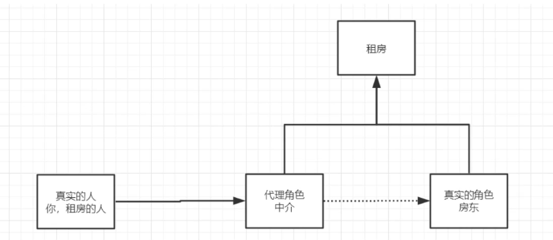
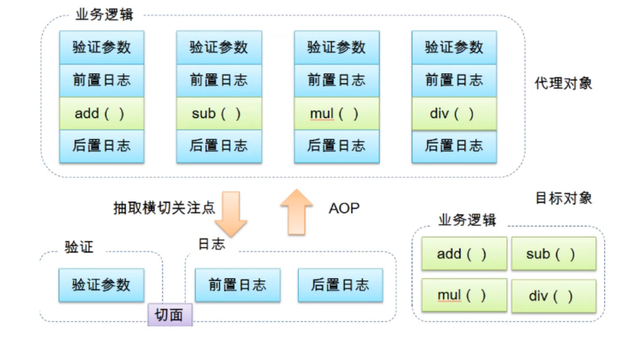

# Spring

##  1. 优点

- Spring是一个开源免费的框架（容器）
- Spring是一个轻量级的，非入侵式的框架
- 控制反转（IOC）、面向切面编程（AOP）
- 支持事务的处理，对框架整合的支持

**Spring就是一个轻量级的控制反转（IOC）和面向切面编程（AOP）的框架**

## 2. 拓展

- SpringBoot
  - 一个快速开发的脚手架
  - 基于SpringBoot可以快速的开发单个微服务
  - 约定大于配置
- SpringClound
  - SpringClound式基于SpringBoot实现的

## 3. IOC的本质

**控制反转IoC（Inversion of Control），是一种设计思想，DI（依赖注入）是实现IOC的一种方法**，没有Ioc的程序中，我们使用面向对象编程，对象的创建和对象之间的依赖关系完全硬编码在程序中，对象的创建由程序自己控制，控制反转后将对象的创建转移给第三方，因此所谓控制反转就是：获得依赖对象的方式反转了

采用XML方式配置Bean的时候，Bean的定义信息是和实现分离的，而采用注解的方式可以把两者合为一体，Bean的定义信息直接以注解的形式定义在实现类中，从而达到了零配置的目的。

**控制反转是一种通过描述（XML或注解）并通过第三方去生产或 获取特定对象的方式。在Spring中实现控制反转的是IOC容器，其实现方法是依赖注入（Denpendency Injection，DI）**

## 4.IOC的创建对象方式

1. 使用无参构造器创建对象，默认

2. 可以使用有参构造器创建对象

   - 下标赋值

     ```xml
     <bean id="user" class="com.zhongmingyuan.pojo.uesr">
         <constructor-arg index="0" value="zhongming"/>
     </bean>
     ```

   - 类型赋值

     ```xml
     <bean id="user" class="com.zhongmingyuan.pojo.uesr">
         <constructor-arg type="java.lang.String" value="zhongming"/>
     </bean>
     ```

   - 参数名

     ```xml
     <bean id="user" class="com.zhongmingyuan.pojo.uesr">
         <constructor-arg name="name" value="zhongming"/>
     </bean>
     ```

总结：在配置文件加载的时候，容器中管理的对象就已经开始初始化了

## 5. spring的配置

### 5.1 别名

```xml
<!--别名，如果添加了别名，我们也可以使用别名获取到这个对象-->
<alias name="user" alias="userNew"/>
```

### 5.2 Bean配置

```xml
<!--
id：bean的唯一标识符，相当于对象名
class：bean对象所对应的全限定名：包名+类型
name：也是别名，而且name可以同时取多个别名
-->
<bean id="user" class="com.zhongmingyuan.pojo.uesr">
    <property name="name" value="zhongming"/>
</bean>
```

### 5.3 import

一般用于团队开发使用，可以将多个配置文件，导入合并成为一个

```xml
<import resource="beans.xml"/>
```

## 6. 依赖注入

### 6.1 构造器注入

如上所述

### 6.2 Set方式注入

- 依赖：bean对象的创建依赖于容器
- 注入：bean对象中所有属性，由容器来注入

```xml
    <bean id="address" class="com.zhongmingyuan.pojo.Address"/>
    <bean id="student" class="com.zhongmingyuan.pojo.Student">
        <!--普通值注入，value-->
        <property name="name" value="zhongmingyuan"/>
        <!--Bean注入，ref-->
        <property name="address" ref="address"/>
        <!--数组注入，ref-->
        <property name="books">
            <array>
                <value>红楼梦</value>
                <value>西游记</value>
            </array>
        </property>
        <!--List注入-->
        <property name="hobbys">
            <list>
                <value>听歌</value>
                <value>电影</value>
            </list>
        </property>
        <!--Map注入-->
        <property name="card">
            <map>
                <entry key="身份证" value="123456"/>
                <entry key="银行卡" value="123456"/>
            </map>
        </property>
        <!--Set注入-->
        <property name="games">
            <set>
                <value>LOL</value>
                <value>COC</value>
            </set>
        </property>
        <!--空值注入-->
        <property name="wife">
            <null/>
        </property>
        <!--Properties注入-->
        <property name="info">
            <props>
                <prop key="学号">123456</prop>
                <prop key="性别">male</prop>
            </props>
        </property>
    </bean>
```

### 6.3 P命名空间注入

```xml
<!--p命名空间注入，可以直接注入属性的值:property -->
<bean id="user" class="com.zhongminyuan.pojo.User" p:name="Tommy" p:age="18"></bean>

<!--c命名空间注入，通过构造器注入:construct-args -->
<bean id="user2" class="com.zhongminyuan.pojo.User2" c:age="18" c:name="Tommy"></bean>
```

注意点：p命名空间和c命名空间不能直接使用，需要导入xml约束

```
xmlns:p="http://www.springframework.org/schema/p"
xmlns:c="http://www.springframework.org/schema/c"
```

### 6.4 Bean的作用域


1. 单例模式（Spring默认机制）

   ```xml
   <bean id="user" class="com.zhongminyuan.pojo.User" p:name="Tommy" p:age="18" scope="singleton"/>
   ```

2. 原型模式：每次从容器中get的时候，都会产生一个新的对象

   ```xml
   <bean id="accountService" class="com.something.DefaultAccountService" scope="prototype"/>
   ```

3. 其余的request、session、application、这些个只能在web开发中使用到

## 7. Bean的自动装配

- 自动装配是Spring满足bean依赖一种方式
- Spring会在上下文中自动寻找，并自动给bean装配属性

在Spring中有上三种装配的方式

1. 在xml中显式配置
2. 在java中显式配置
3. 隐式的自动装配bena（重要）

### 7.1byName自动装配

```xml
<bean id="cat" class="com.zhongmingyuan.pojo.cat"/>
<bean id="dog" class="com.zhongmingyuan.pojo.dog"/>
<!--
 byName:会自动在容器上下文查找，和自己对象set方法后面的值对应的bean id
-->
<bean id="people" class"com.zhongmingyuan.pojo.people" autowire="byName">
	<property name="name" value="Tommy"/>
</bean>
```

### 7.2 byType自动装配

```xml
<bean id="cat" class="com.zhongmingyuan.pojo.cat"/>
<bean id="dog" class="com.zhongmingyuan.pojo.dog"/>
<!--
 byName:会自动在容器上下文查找，和自己对象类型相同的Bean
-->
<bean id="people" class"com.zhongmingyuan.pojo.people" autowire="byType">
	<property name="name" value="Tommy"/>
</bean>
```

小结：

- byName的时候，需要保证所有bean的id唯一，并且这个bean需要和自动注入的属性的set方法的值一致
- byName的时候，需要保证所有bean的class唯一，并且这个bean需要和自动注入的属性的类型一致

### 7.3 使用注解实现自动装配

jdk1.5支持的注解，spring2.5支持注解

要使用注解须知

1. 导入约束：contex约束

2. 配置注解的支持：<context:annotation-config/>


```xml
<?xml version="1.0" encoding="UTF-8"?>
<beans xmlns="http://www.springframework.org/schema/beans"
    xmlns:xsi="http://www.w3.org/2001/XMLSchema-instance"
    xmlns:context="http://www.springframework.org/schema/context"
    xsi:schemaLocation="http://www.springframework.org/schema/beans
        https://www.springframework.org/schema/beans/spring-beans.xsd
        http://www.springframework.org/schema/context
        https://www.springframework.org/schema/context/spring-context.xsd">

    <context:annotation-config/>

</beans>
```


**@AutoWired**

- 直接在属性上使用即可，也可以在set方式上使用
- 使用Autowired我们可以不用编写Set方法，前提是你的这个自动装配的属性在IOC容器中存在，且符合byName

**@Qualifier**

- 如果@Autowired自动装配的环境比较复杂，自动装配无法通过一个注解完成时，我们可以通过使用@Qualifier(value="xxx")去配置@Autowried的使用，指定一个唯一的bean对象注入

**@Resource**

- @Resource和@Autowried的区别：
  - 都是用来自动装配，都可以放在属性字段上。
  - @Autowired默认byType的方式实现，其次是byName
  - @Resource默认是byName方式实现，其次是byType

## 8.Spring注解开发

在Spring4之后，要使用注解开发，必须要保证aop包的导入，且使用注解要导入context约束，增加对注解的支持

```xml
<?xml version="1.0" encoding="UTF-8"?>
<beans xmlns="http://www.springframework.org/schema/beans"
       xmlns:xsi="http://www.w3.org/2001/XMLSchema-instance"
       xmlns:context="http://www.springframework.org/schema/context"
       xsi:schemaLocation="http://www.springframework.org/schema/beans
        https://www.springframework.org/schema/beans/spring-beans.xsd
        http://www.springframework.org/schema/context
        https://www.springframework.org/schema/context/spring-context.xsd">

    <context:annotation-config/>
    <!--指定要扫描的包，这个包下的注解就会生效-->
    <context:component-scan base-package="com.zhongmingyuan"/>

</beans>
```

1. Beans

   ```java
   /*
   * 等价于<bean id="user" class="com.zhongmingyuan.pojo.User">
   * @Component组件
   * */
   @Component
   @Scope("singleton")
   public class User {
       @Value("zhongmingYuan")
       private String name;
   
       public String getName() {
           return name;
       }
   
       public void setName(String name) {
           this.name = name;
       }
   }
   ```

2. 属性如何注入

   通过@Value注解注入

3. 衍生的注解

   @Component有几个衍生注解，我们在web开发中，会按照mvc三层架构分层

   - Dao【@Repository】
   - Service【@Service】
   - Controller【@Controller】
   - 这四个注解的功能是一样的，都是代表将某个类注册到Spring中，装配Bean

4. 自动装配配置

5. 作用域

   ```java
   @Scope("singleton")
   ```

6. 小结

   XML与注解

   - XML更加万能，适用于任何场合，维护方便简单
   - 注解不是自己的类使用不了，维护相对复杂

   XML与注解的最佳实践

   - XML用来管理bean；
   - 注解只负责完成属性的注入
   - 需要注意：必须让注解生效，就需要开启注解的支持

## 9.使用JAVA方式配置spring

```java
package com.zhongming.pojo;

import org.springframework.beans.factory.annotation.Value;

public class Person {

    @Value("Tommy")
    private String name;

    public Person() {
    }

    public Person(String name) {
        this.name = name;
    }

    public String getName() {
        return name;
    }

    public void setName(String name) {
        this.name = name;
    }
}

```

```java
@Configuration
public class MyConfig {

    @Bean
    public Person getPerson(){
        return new Person();
    }
}
```

```java
public class MyTest {
    public static void main(String[] args) {
        ApplicationContext context = new AnnotationConfigApplicationContext(MyConfig.class);
        Person person = (Person) context.getBean("getPerson");
        System.out.println(person.getName());
    }
```


## 10.代理模式

代理模式的分类：

- 静态代理
- 动态代理

### 10.1 代理模式



角色分析：

- 抽象角色：一般会使用接口或者抽象类解决
- 真实角色：被代理的角色
- 代理角色：代理真实角色，代理真实角色后，一般会做一些附属操作
- 客户：访问代理对象的人

代理模式的好处：

- 可以使真实角色的操作更加纯粹，不用去关注一些公共的业务
- 公共业务交给代理角色，实现业务的分工
- 公共业务发生拓展的时候，方便集中管理

代码步骤：

1. 接口

   ```java
   public interface Rent {
       public void rent();
   }
   ```

   

2. 真实角色

   ```java
   public class Host implements Rent{
       public void rent() {
           System.out.println("房东出租房子");
       }
   }
   ```

   

3. 代理角色

   ```java
   public class Proxy implements Rent{
       private Host host;
       public Proxy(Host host) {
           this.host = host;
       }
   
       public void rent() {
           seeHouse();
           host.rent();
           sign();
       }
   
       public void seeHouse(){
           System.out.println("看房");
       }
   
       public void sign(){
           System.out.println("签约");
       }
   }
   ```

   

4. 客户端访问代理

   ```java
   public class Client {
       public static void main(String[] args) {
           Host host = new Host();
           Proxy proxy = new Proxy(host);
           proxy.rent();
       }
   
   }
   ```

   

缺点：

- 一个真实角色就会产生一个代理角色：代码量翻倍

### 10.2 动态代理

- 动态代理和静态代理角色一样
- 动态代理的代理类是动态生成的，不是直接写好的
- 动态代理分为两大类：
  - 基于接口的动态代理：JDK动态代理
  - 基于类的动态代理：cglib
  - java字节码实现：javasist

需要了解两个类：Proxy，InvocationHandler（调用处理程序）

```java
//使用这个类自动生成代理类
public class ProxyInvocationHandler implements InvocationHandler {

    //被代理的接口
    private Object target;

    public void setTarget(Object target) {
        this.target = target;
    }
    
    //生成得到代理类
    public Object getProxy(){
        return Proxy.newProxyInstance(this.getClass().getClassLoader(),target.getClass().getInterfaces(),this);
    }

    //处理代理实例，并返回结果
    public Object invoke(Object proxy, Method method, Object[] args) throws Throwable {
        Object result = method.invoke(target,args);
        return result;
    }
}
```

```java
public class Client {
    public static void main(String[] args) {
        //真实角色
        Rent rent = new Host();
        //代理角色
        ProxyInvocationHandler pih = new ProxyInvocationHandler();
        pih.setTarget(rent);
        //动态生成代理类
        Rent proxy = (Rent)pih.getProxy();
        proxy.rent();
    }
}
```

**动态代理的优点：**

- 一个动态代理类代理的是一个接口，一般就是对应的一类业务
- 一个动态代理类可以代理多个类，只要是实现了同一个接口即可

## 11. AOP

### 11.1 什么是AOP

AOP（Aspect Oriented Programming）意为：面向切面编程，通过预编译方式和运行期动态代理实现程序功能的统一维护的一种技术。AOP是OOP的延续，是软件开发中的一个热点，也是Spring框架中的一个重要的内容，是函数式编程的一种衍生范型。利用AOP可以对业务逻辑的各个部分进行隔离，从而使得业务逻辑各部分之间的耦合度降低，提高程序的可重用行，同时提高了开发的效率。



### 11.2 AOP在Spring中的作用

提供声明式事务；允许用户自定义切面

- 横切关注点：跨越应用程序多个模块的方法或功能。即是，与我们业务逻辑无关的，但是我们需要关注的部分，就是横切关注点。如日志，安全，缓存，事务等等
- 切面（Aspect）：横切关注点被模块化的特殊对象。即，它是一个类。
- 通知（Advice）：切面必须要完成的工作。即，它是类中的一个方法。
- 目标（Target）：被通知对象。
- 代理（Proxy）：向目标对象应用通知之后创建的对象。
- 切入点（PointCut）：切面通知执行的“地点”的定义。
- 连接点（JointPoint）：与切入点匹配的执行点。

### 11.3 使用Spring实现AOP

使用AOP织入，需要导入一个依赖包

```xml
  <!-- https://mvnrepository.com/artifact/org.aspectj/aspectjweaver -->
        <dependency>
            <groupId>org.aspectj</groupId>
            <artifactId>aspectjweaver</artifactId>
            <version>1.9.4</version>
        </dependency>
    </dependencies>
```

方式一：使用Spring的API接口

```java
public class Log implements MethodBeforeAdvice {

    //method:要执行的目标对象方法
    //args:参数
    //target:目标对象
    public void before(Method method, Object[] args, Object target) throws Throwable {
        System.out.println(target.getClass().getName()+"的"+method.getName()+"被执行了");
    }
}
```

```java
public class Log2 implements AfterReturningAdvice {
    public void afterReturning(Object o, Method method, Object[] objects, Object o1) throws Throwable {
        System.out.println("执行了"+method.getName()+"方法，返回结果为"+o);
    }
}
```

```xml
    <!--方式一：使用原生Spring API接口-->
    <aop:config>
        <!--切入点-->
        <aop:pointcut id="pointcut" expression="execution(* com.zhongmingyuan.service.UserServiceImpl.*(..))"/>
        <!--执行环绕增强-->
        <aop:advisor advice-ref="log" pointcut-ref="pointcut"/>
        <aop:advisor advice-ref="log2" pointcut-ref="pointcut"/>
    </aop:config>
```

方式二：使用自定义类实现AOP

```xml
    <bean id="cut" class="com.zhongmingyuan.pointcut.PointCut"/>

    <aop:config>
        <!--自定义切面-->
        <aop:aspect ref="cut">
            <!--切入点-->
            <aop:pointcut id="pointcut" expression="execution(* com.zhongmingyuan.service.UserServiceImpl.*(..))"/>
            <!--通知-->
            <aop:before method="before" pointcut-ref="pointcut"/>
            <aop:after method="after" pointcut-ref="pointcut"/>
        </aop:aspect>

    </aop:config>
```

```java
//这个就是切面
public class PointCut {
    public void before(){
        System.out.println("方法执行前");
    }
    public void after(){
        System.out.println("方法执行后");
    }
}
```

方式三：使用注解实现

```java
//方式三：使用注解实现AOP
@Aspect//标注这个类为一个切面
public class AnnotationPointCut {
    @Before("execution(* com.zhongmingyuan.service.UserServiceImpl.*(..))")
    public void before(){
        System.out.println("方法执行前");
    }
    @After("execution(* com.zhongmingyuan.service.UserServiceImpl.*(..))")
    public void after(){
        System.out.println("方法执行后");
    }
}
```

```xml
    <bean id="annotationPointCut" class="com.zhongmingyuan.annotaion.AnnotationPointCut"/>
    <!--开启注解支持-->
    <aop:aspectj-autoproxy proxy-target-class="false"/>
    <!--proxy-target-class="false"为默认jdk实现动态代理，设置为true的时候为cglib动态代理 -->
```

```java
    //在环绕增强中，我们可以给定一个参数，代表我们要获取处理切入的点：
    @Around("execution(* com.zhongmingyuan.service.UserServiceImpl.*(..))")
    public void around(ProceedingJoinPoint jp) throws Throwable {
        System.out.println("before around");
        Signature signature = jp.getSignature();
        System.out.println(signature);
        Object o =  jp.proceed();
        System.out.println("after around");
    }
```

## 12. MyBatis-Spring

1. 编写数据源

   ```xml
       <!--DataSource:使用Spring的数据源替换MyBatis的配置-->
       <bean id="dataSource" class="org.springframework.jdbc.datasource.DriverManagerDataSource">
           <property name="driverClassName" value="com.mysql.cj.jdbc.Driver"/>
           <property name="url" value="jdbc:mysql://localhost:3306/o2o?useUnicode=true&amp;characterEncoding=utf8&amp;serverTimezone=GMT%2B8"/>
           <property name="username" value="root"/>
           <property name="password" value="****"/>
       </bean>
   ```

   

2. sqlSessionFactory

   ```xml
       <bean id="sqlSessionFactory" class="org.mybatis.spring.SqlSessionFactoryBean">
           <property name="dataSource" ref="dataSource"/>
           <!--绑定Mybatis配置文件-->
           <property name="configLocation" value="classpath:mybatis-conf.xml"/>
           <property name="mapperLocations" value="classpath:com/zhongmingyuan/mapper/*.xml"/>
       </bean>
   ```

   

3. sqlSessionTemplate

   ```xml
       <!--SqlSessionTemplate-->
       <bean id="sqlSession" class="org.mybatis.spring.SqlSessionTemplate">
           <!--只能用构造器注入sqlSession-->
           <constructor-arg index="0" ref="sqlSessionFactory"/>
       </bean>
   ```

   

4. 需要给接口加实现类

   ```java
   public class AreaDaoImpl implements AreaDao{
   
       private SqlSession sqlSession;
   
       public void setSqlSession(SqlSession sqlSession) {
           this.sqlSession = sqlSession;
       }
   
       public List<Area> queryArea() {
           return sqlSession.getMapper(AreaDao.class).queryArea();
       }
   
       public int addArea(Area area) {
           return sqlSession.getMapper(AreaDao.class).addArea(area);
       }
   
       public int deleteArea(String name) {
           return sqlSession.getMapper(AreaDao.class).deleteArea(name);
       }
   }
   ```

   

5. 将自己写的实现类注入到Spring中

   ```xml
       <bean id="areaDao" class="com.zhongmingyuan.mapper.AreaDaoImpl">
           <property name="sqlSession" ref="sqlSession"/>
       </bean>
   ```

   

## 13. 声明式事务

### 13.1 回顾事务

- 把一组业务当成一个业务来做：要么都成功，要么都失败
- 事务在项目开发中，十分重要，涉及到数据一致性问题
- 确保完整性和一致性

事务的ACID原则

- 原子性
- 一致性
- 隔离性：多个业务可能操作同一个资源，防止数据损坏
- 持久性：事务一旦提交，无论系统发生什么问题，结果都不会再被影响，被持久化的写进存储器中

### 13.2 Spring中的事务管理

- 声明式事务：aop
- 编程式事务：使用try catch抛出异常实现事务管理

```xml
    <!--结合AOP实现事务的织入-->
    <!--配置事务通知-->
    <tx:advice id="txAdvice" transaction-manager="transactionManager">
        <!--给哪些方法配置事务-->
        <!--配置事务的传播特性：new propagation-->
        <tx:attributes>
            <tx:method name="add" propagation="REQUIRED"/>
            <tx:method name="delete"/>
            <tx:method name="update"/>
            <tx:method name="query" read-only="true"/>
            <tx:method name="*"/>
        </tx:attributes>
    </tx:advice>

    <!--配置事务切入-->
    <aop:config>
        <aop:pointcut id="txPointCut" expression="execution(* com.zhongmingyuan.service.*.*(..))"/>
        <aop:advisor advice-ref="txAdvice" pointcut-ref="txPointCut"/>
    </aop:config>
```


