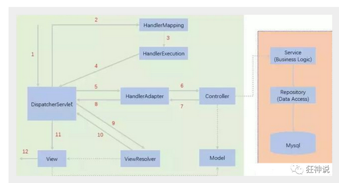

# 什么是MVC：

模型（dao、service）、视图（jsp）、控制器（Servlet），是一种软件设计规范

职责分析：

- **Controller**
  - 取得表单数据
  - 调用业务逻辑
  - 转向指定的页面
- **Model**
  - 业务逻辑
  - 保存数据状态
- **View**
  - 显示页面

MVC框架要做的事情

1. 将URL映射到java类或java类的方法
2. 封装用户提交的数据
3. 处理请求--调用相关的业务处理--封装响应数据
4. 将响应的数据进行渲染 ，jsp/html等表示层数据

# 什么是SpringMVC

##  中心控制器

Spring的web框架围绕DispatcherServlet设计。DispatcherServlet的作用是将请求分发到不同的处理器。从Spring 2.5开始，使用Java 5或者以上版本的用户可以采用基于注解的controller声明方式。

Spring MVC框架像许多其他MVC框架一样, **以请求为驱动** , **围绕一个中心Servlet分派请求及提供其他功能**，**DispatcherServlet是一个实际的Servlet (它继承自HttpServlet 基类)**。



简要分析执行流程

1. DispatcherServlet表示前置控制器，是整个SpringMVC的控制中心。用户发出请求，DispatcherServlet接收请求并拦截请求。

   **如上url拆分成三部分：**

   - http://localhost:8080服务器域名

   - SpringMVC部署在服务器上的web站点

   - hello表示控制器

   通过分析，如上url表示为：请求位于服务器localhost:8080上的SpringMVC站点的hello控制器。

2. HandlerMapping为处理器映射。DispatcherServlet调用HandlerMapping,HandlerMapping根据请求url查找Handler。

3. HandlerExecution表示具体的Handler,其主要作用是根据url查找控制器，如上url被查找控制器为：hello。

4. HandlerExecution将解析后的信息传递给DispatcherServlet,如解析控制器映射等。

5. HandlerAdapter表示处理器适配器，其按照特定的规则去执行Handler。

6. Handler让具体的Controller执行。

7. Controller将具体的执行信息返回给HandlerAdapter,如ModelAndView。

8. HandlerAdapter将视图逻辑名或模型传递给DispatcherServlet。

9. DispatcherServlet调用视图解析器(ViewResolver)来解析HandlerAdapter传递的逻辑视图名。

10. 视图解析器将解析的逻辑视图名传给DispatcherServlet。

11. DispatcherServlet根据视图解析器解析的视图结果，调用具体的视图。

12. 最终视图呈现给用户。

# 使用注解开发SpringMVC

1. 新建一个web项目

2. 导入相关jar包

3. 编写web.xml , 注册DispatcherServlet

   ```xml
   <?xml version="1.0" encoding="UTF-8"?>
   <web-app xmlns="http://xmlns.jcp.org/xml/ns/javaee"
            xmlns:xsi="http://www.w3.org/2001/XMLSchema-instance"
            xsi:schemaLocation="http://xmlns.jcp.org/xml/ns/javaee http://xmlns.jcp.org/xml/ns/javaee/web-app_4_0.xsd"
            version="4.0">
       <!--1.注册servlet-->
       <servlet>
           <servlet-name>SpringMVC</servlet-name>
           <servlet-class>org.springframework.web.servlet.DispatcherServlet</servlet-class>
           <!--通过初始化参数指定SpringMVC配置文件的位置，进行关联-->
           <init-param>
               <param-name>contextConfigLocation</param-name>
               <param-value>classpath:springmvc-servlet.xml</param-value>
           </init-param>
           <!-- 启动顺序，数字越小，启动越早 -->
           <load-on-startup>1</load-on-startup>
       </servlet>
   
       <!--所有请求都会被springmvc拦截 -->
       <servlet-mapping>
           <servlet-name>SpringMVC</servlet-name>
           <url-pattern>/</url-pattern>
       </servlet-mapping>
   </web-app>
   ```

   

4. 编写springmvc配置文件

   ```xml
   <?xml version="1.0" encoding="UTF-8"?>
   <beans xmlns="http://www.springframework.org/schema/beans"
          xmlns:xsi="http://www.w3.org/2001/XMLSchema-instance"
          xmlns:context="http://www.springframework.org/schema/context"
          xmlns:mvc="http://www.springframework.org/schema/mvc"
          xsi:schemaLocation="http://www.springframework.org/schema/beans
           https://www.springframework.org/schema/beans/spring-beans.xsd
           http://www.springframework.org/schema/context
           https://www.springframework.org/schema/context/spring-context.xsd
           http://www.springframework.org/schema/mvc
           https://www.springframework.org/schema/mvc/spring-mvc.xsd">
       <!--自动扫描包，让指定包下的注解生效，由IOC容器统一管理-->
       <context:component-scan base-package="com.zhongming.controller"/>
       <!--让Spring MVC不处理静态资源-->
       <mvc:default-servlet-handler/>
       <!--
       支持MVC注解驱动
       在spring中一般采用@RequestMapping注解来完成映射关系
       要使@RequestMapping注解生效
       必须向上下文中注册DefaultAnnotationHandlerMapping和一个AnnotationMethodHandlerAdapter实例
       这两个实例分别在类级别和方法级别处理
       而annotation-driven配置帮助我们自动完成上述两个实例的注入
       -->
       <mvc:annotation-driven/>
       <!--视图解析器-->
       <bean class="org.springframework.web.servlet.view.InternalResourceViewResolver" id="InternalResourceViewResolver">
           <!--前缀-->
           <property name="prefix" value="/WEB-INF/jsp/"/>
           <!--后缀-->
           <property name="suffix" value=".jsp"/>
       </bean>
   </beans>
   ```

5. 接下来就是去创建对应的控制类 , controller

6. 最后完善前端视图和controller之间的对应

   ```java
   package com.zhongming.controller;
   
   import org.springframework.stereotype.Controller;
   import org.springframework.ui.Model;
   import org.springframework.web.bind.annotation.RequestMapping;
   
   @Controller
   @RequestMapping("/zhongming")
   public class HelloController {
   
       @RequestMapping("/hello")
       public String hello(Model model){
           //封装数据
           model.addAttribute("msg","Hello,SpringMvcAnnotation");
           return "hello"; //会被视图解析器处理
       }
   }
   ```

7. 测试运行调试.

# RestFul和控制器

## 控制器Controller

- 控制器复杂提供访问应用程序的行为，通常通过接口定义或注解定义两种方法实现。
- 控制器负责解析用户的请求并将其转换为一个模型。
- 在Spring MVC中一个控制器类可以包含多个方法
- 在Spring MVC中，对于Controller的配置方式有很多种

使用接口定义控制器

说明

- 实现接口Controller定义控制器是较老的办法
- 缺点是：一个控制器中只有一个方法，如果要多个方法则需要定义多个Controller；定义的方式比较麻烦；

## RestFul风格

**概念**

Restful就是一个资源定位及资源操作的风格。不是标准也不是协议，只是一种风格。基于这个风格设计的软件可以更简洁，更有层次，更易于实现缓存等机制。

**传统方式操作资源**  ：通过不同的参数来实现不同的效果！方法单一，post 和 get

​	http://127.0.0.1/item/queryItem.action?id=1 查询,GET

​	http://127.0.0.1/item/saveItem.action 新增,POST

​	http://127.0.0.1/item/updateItem.action 更新,POST

​	http://127.0.0.1/item/deleteItem.action?id=1 删除,GET或POST

**使用RESTful操作资源** ：

- 可以通过不同的请求方式来实现不同的效果！如下：请求地址一样，但是功能可以不同！

  - http://127.0.0.1/item/1 查询,GET
  - http://127.0.0.1/item 新增,POST
  - http://127.0.0.1/item 更新,PUT
  - http://127.0.0.1/item/1 删除,DELETE

- 使用路径变量

  - 使路径变得更加简洁；
  - 获得参数更加方便，框架会自动进行类型转换。
  - 通过路径变量的类型可以约束访问参数，如果类型不一样，则访问不到对应的请求方法，如这里访问是的路径是/commit/1/a，则路径与方法不匹配，而不会是参数转换失败。

  ```java
  @Controller
  public class RestFulController {
      //原来的: http://localhost:8080/add?a=1&b=2
      //RestFul:http://localhost:8080/add/1/2
  
      @RequestMapping(value = "add/{a}/{b}")
      public String restFul(@PathVariable int a, @PathVariable int b, Model model){
          int res = a+b;
          model.addAttribute("msg",res);
          return "hello";
      }
  }
  ```

# SpringMVC结果跳转方式

**通过SpringMVC来实现转发和重定向 - 无需视图解析器；**

```java
@Controller
public class ResultSpringMVC {
   @RequestMapping("/rsm/t1")
   public String test1(){
       //转发
       return "/WEB-INF/index.jsp";
  }

   @RequestMapping("/rsm/t2")
   public String test2(){
       //转发二
       return "forward:/index.jsp";
  }

   @RequestMapping("/rsm/t3")
   public String test3(){
       //重定向
       return "redirect:/index.jsp";
  }
}
```

**通过SpringMVC来实现转发和重定向 - 有视图解析器**

```java
@Controller
public class ResultSpringMVC2 {
   @RequestMapping("/rsm2/t1")
   public String test1(){
       //转发
       return "test";
  }

   @RequestMapping("/rsm2/t2")
   public String test2(){
       //重定向
       return "redirect:/index.jsp";
       //return "redirect:hello.do"; //hello.do为另一个请求/
  }
}
```

# SpringMVC数据处理

## 处理提交数据

**1、提交的域名称和处理方法的参数名一致**

提交数据 : http://localhost:8080/hello?name=kuangshen

处理方法 :

```java
@RequestMapping("/hello")
public String hello(String name){
   System.out.println(name);
   return "hello";
}
```

后台输出 : kuangshen

**2、提交的域名称和处理方法的参数名不一致**

提交数据 : http://localhost:8080/hello?username=kuangshen

处理方法 :

```java
//@RequestParam("username") : username提交的域的名称 .
@RequestMapping("/hello")
public String hello(@RequestParam("username") String name){
   System.out.println(name);
   return "hello";
}
```

后台输出 : kuangshen

**3、提交的是一个对象**

要求提交的表单域和对象的属性名一致  , 参数使用对象即可

1、实体类

```java
public class User {
   private int id;
   private String name;
   private int age;
   //构造
   //get/set
   //tostring()
}
```

2、提交数据 : http://localhost:8080/mvc04/user?name=kuangshen&id=1&age=15

3、处理方法 :

```java
@RequestMapping("/user")
public String user(User user){
   System.out.println(user);
   return "hello";
}
```

后台输出 : User { id=1, name='kuangshen', age=15 }

说明：如果使用对象的话，前端传递的参数名和对象名必须一致，否则就是null。

## 数据显示到前端

**第一种 : 通过ModelAndView**

```java
public class ControllerTest1 implements Controller {

   public ModelAndView handleRequest(HttpServletRequesthttpServletRequest, HttpServletResponse httpServletResponse) throwsException {
       //返回一个模型视图对象
       ModelAndView mv = new ModelAndView();
       mv.addObject("msg","ControllerTest1");
       mv.setViewName("test");
       return mv;
  }
}
```

**第二种 : 通过ModelMap**

```java
@RequestMapping("/hello")
public String hello(@RequestParam("username") String name, ModelMapmodel){
   //封装要显示到视图中的数据
   //相当于req.setAttribute("name",name);
   model.addAttribute("name",name);
   System.out.println(name);
   return "hello";
}
```

**第三种 : 通过Model**

```java
@RequestMapping("/ct2/hello")
public String hello(@RequestParam("username") String name, Modelmodel){
   //封装要显示到视图中的数据
   //相当于req.setAttribute("name",name);
   model.addAttribute("msg",name);
   System.out.println(name);
   return "test";
}
```

区别：

```
Model 只有寥寥几个方法只适合用于储存数据，简化了新手对于Model对象的操作和理解；

ModelMap 继承了 LinkedMap ，除了实现了自身的一些方法，同样的继承 LinkedMap 的方法和特性；

ModelAndView 可以在储存数据的同时，可以进行设置返回的逻辑视图，进行控制展示层的跳转。
```

# 乱码问题

使用SpringMVC的编码过滤器解决

```xml
    <!--设置SpringMVC的编码过滤器-->
    <filter>
        <filter-name>encoding</filter-name>
        <filter-class>org.springframework.web.filter.CharacterEncodingFilter</filter-class>
        <init-param>
            <param-name>encoding</param-name>
            <param-value>utf-8</param-value>
        </init-param>
    </filter>
    <!--对所有url请求进行过滤-->
    <filter-mapping>
        <filter-name>encoding</filter-name>
        <url-pattern>/*</url-pattern>
    </filter-mapping>
```

# JASON

前后分离时代：

- 后端部署后端，提供接口
- 前端独立部署，负责渲染后端的数据

## Controller返回JSON数据

Jackson应该是目前比较好的json解析工具了

当然工具不止这一个，比如还有阿里巴巴的 fastjson 等等。

我们这里使用Jackson，使用它需要导入它的jar包；

```xml
<!-- https://mvnrepository.com/artifact/com.fasterxml.jackson.core/jackson-core -->
<dependency>
   <groupId>com.fasterxml.jackson.core</groupId>
   <artifactId>jackson-databind</artifactId>
   <version>2.9.8</version>
</dependency>
```

# SpringMVC拦截器

SpringMVC的处理器拦截器类似于Servlet开发中的过滤器Filter,用于对处理器进行预处理和后处理。开发者可以自己定义一些拦截器来实现特定的功能。

**过滤器与拦截器的区别：**拦截器是AOP思想的具体应用。

**过滤器**

- servlet规范中的一部分，任何java web工程都可以使用
- 在url-pattern中配置了/*之后，可以对所有要访问的资源进行拦截

**拦截器** 

- 拦截器是SpringMVC框架自己的，只有使用了SpringMVC框架的工程才能使用
- 拦截器只会拦截访问的控制器方法， 如果访问的是jsp/html/css/image/js是不会进行拦截的

##  自定义拦截器

那如何实现拦截器呢？

想要自定义拦截器，必须实现 HandlerInterceptor 接口。

1、新建一个Moudule ， springmvc-07-Interceptor ， 添加web支持

2、配置web.xml 和 springmvc-servlet.xml 文件

3、编写一个拦截器

```java
package com.kuang.interceptor;

import org.springframework.web.servlet.HandlerInterceptor;
import org.springframework.web.servlet.ModelAndView;

import javax.servlet.http.HttpServletRequest;
import javax.servlet.http.HttpServletResponse;

public class MyInterceptor implements HandlerInterceptor {

   //在请求处理的方法之前执行
   //如果返回true执行下一个拦截器
   //如果返回false就不执行下一个拦截器
   public boolean preHandle(HttpServletRequest httpServletRequest,HttpServletResponse httpServletResponse, Object o) throws Exception {
       System.out.println("------------处理前------------");
       return true;
  }

   //在请求处理方法执行之后执行
   public void postHandle(HttpServletRequest httpServletRequest,HttpServletResponse httpServletResponse, Object o, ModelAndViewmodelAndView) throws Exception {
       System.out.println("------------处理后------------");
  }

   //在dispatcherServlet处理后执行,做清理工作.
   public void afterCompletion(HttpServletRequest httpServletRequest,HttpServletResponse httpServletResponse, Object o, Exception e)throws Exception {
       System.out.println("------------清理------------");
  }
}
```

4、在springmvc的配置文件中配置拦截器

```java
<!--关于拦截器的配置-->
<mvc:interceptors>
   <mvc:interceptor>
       <!--/** 包括路径及其子路径-->
       <!--/admin/* 拦截的是/admin/add等等这种 , /admin/add/user不会被拦截-->
       <!--/admin/** 拦截的是/admin/下的所有-->
       <mvc:mapping path="/**"/>
       <!--bean配置的就是拦截器-->
       <bean class="com.kuang.interceptor.MyInterceptor"/>
   </mvc:interceptor>
</mvc:interceptors>
```

5、编写一个Controller，接收请求

```java
package com.kuang.controller;

import org.springframework.stereotype.Controller;
import org.springframework.web.bind.annotation.RequestMapping;
import org.springframework.web.bind.annotation.ResponseBody;

//测试拦截器的控制器
@Controller
public class InterceptorController {

   @RequestMapping("/interceptor")
   @ResponseBody
   public String testFunction() {
       System.out.println("控制器中的方法执行了");
       return "hello";
  }
}
```

# 文件上传和下载